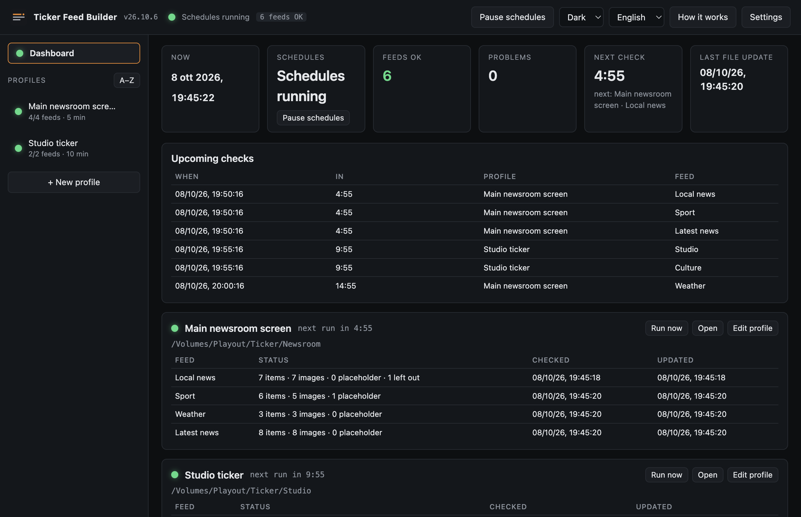

# Ticker Feed Builder

Downloads RSS feeds on a schedule and turns each one into numbered text lines and JPG images for TV tickers and playout graphics. Free desktop app (Electron) from [OnAir Garage](https://onairgarage.com).

- Tool page: https://onairgarage.com/tools/ticker-feed-builder/
- Author: Graziano Melzi · OnAir Garage — hello@onairgarage.com
- License: MIT (see `LICENSE`)
- Systems: Windows (installer), macOS (dmg, Apple silicon and Intel), Linux (AppImage, x64). Built for all three; **only macOS has been run so far** (see Validation).



_Screenshots use invented demo feeds, taken on macOS (dark and light themes)._

## What it does

It replaces the `rss_ticker_downloader.py` scripts that fed NeMedia Morpheus from Windows Task Scheduler. The app lives in the tray, runs 24/7 and, for every feed of every profile, writes:

| File | Content |
|---|---|
| `<Name>_Title.Txt` | one headline per line |
| `<Name>_Description.Txt` | one description per line, same order |
| `<Name>/00001.JPG, 00002.JPG…` | one JPG per story, same order |
| `<Name>_metadata.json` | counters of the last run (optional) |

- **Profiles**: one destination each (output folder, feeds, interval, placeholder image, format). Use several if different screens read different folders.
- **Sync guarantee**: story N is line N of both text files and image N. Line breaks and invisible characters inside a text are removed; an empty title/description becomes `-` (configurable); a missing or unreadable image becomes the placeholder image.
- **Safe writes**: each file is written under a temporary name and renamed; unchanged files are not touched; if a download fails the previous files stay as they were; a missing output folder is reported and never created (an unplugged drive must not become a local folder); numbered images left over from a longer previous run are removed.
- **Configurable format** (the defaults reproduce the original scripts): text encoding (UTF-8, UTF-8 with BOM, Windows-1252), line ending, file name templates (`{folder}`), image number start/digits/extension, JPEG quality, optional resize (fill or fit), title/description length limits.
- **Checks**: each profile has a check interval (default 5 min) and each feed can have its own. A check first asks the server whether the feed changed (`ETag` / `Last-Modified`; answer 304 = nothing is downloaded). If the server cannot say, the feed is downloaded and its content compared with the previous copy (same content = no image download, no file touched). Images are downloaded and files written only when something is new; a failed image is retried at the next check, and a deleted output file or an edited setting triggers a rebuild. "Run now" always rebuilds everything.
- **Dashboard** (its own button above the profile list): date and time, schedule state, feeds OK / with problems, a time-ordered list of the next checks (what will be checked and when, with countdown), per profile and per feed last check and last file update with date and time, recent warnings and errors. Profiles show in the order of the left column.
- **Profile order**: drag the profiles in the left column, use the ▲▼ buttons or Alt + arrow keys, or press A–Z for alphabetical order. The order is saved and the dashboard follows it.
- **Choosing the stories**: per feed, keep only stories with certain words or leave out others (case and accents ignored, title only or title + description), remove same-title duplicates, order newest first; the filters work before the item limit. A profile can leave out a story already used by an earlier feed. **Merged feeds** put the latest stories of several feeds in one folder (newest first, no duplicates). The test dialog shows the stories exactly as they would be written (file names, title and description lines, image).
- **Time windows**: a profile can be checked only in certain hours and days (e.g. 06:00–24:00), and a window can have its own interval. Outside the windows nothing is checked and the files stay as they are.
- **Frozen-feed alert**: alert when a feed answers but has had no new stories for N hours (per profile or per feed), and again on recovery. **Daily summary** at chosen times on Telegram and/or email.
- **File check**: after writing, the files are read back (as many title and description lines as stories, every image a real JPEG); a failed check or a file locked by a player counts as a failed feed.
- **Memory between restarts**: what each feed looked like is saved, so after a restart an unchanged feed is not rebuilt and no image is downloaded again.
- **WebP and AVIF** images are converted to JPEG with WebAssembly decoders (can be switched off per profile).
- **Headless mode** (`src/cli.js`): the same engine without a window, for a server or a machine that must update the ticker after a restart before anyone logs in. See "Headless mode" below.
- **Alerts**: desktop notification, Telegram and/or email (SMTP) when a feed fails N runs in a row, when an output folder disappears, and on recovery. Telegram and email take several recipients; the email goes out as one message with all recipients in Bcc. Passwords and tokens stay on the computer, encrypted with the system keystore when available, and are never exported. With an SMTP user name the connection must be encrypted (STARTTLS or TLS). Each channel has a test button.
- Feed test with preview (nothing is written), live log with daily log files, settings export/import (the Telegram token is never exported), update check against the public GitHub releases with a download verified against `SHA256SUMS.txt`, start with the computer, keep-awake option.
- Languages: English (default, the app always opens in English), Italiano, Español; the choice is remembered. Theme: dark (default), light, or follow the system.

The default layout is the one the original scripts produced for NeMedia Morpheus. **It has not been checked against NeMedia documentation** (none was read); other ticker systems may need other names, encodings or sizes, which is why everything is configurable.

## Feeds and publishers' terms

A feed that is free to download is not necessarily free to broadcast. Publishers usually offer RSS for personal reading; showing their headlines publicly on TV, screens or websites normally needs an agreement with the publisher. That responsibility is the user's; this is not legal advice. The app ships **without any feed**; the examples below come from the pages read on 8 October 2026 (paraphrased; the pages carry no version or date, so read the current text before relying on it).

| Publisher | What its RSS page says | Page |
|---|---|---|
| ANSA | Non-commercial use by individuals and non-profit organisations, only to view the feeds in RSS reader programs; using them to publish the latest headlines on websites or blogs is not allowed; any other use must be requested and expressly authorised. | https://www.ansa.it/sito/static/ansa_rss.html |
| Adnkronos | Non-commercial use by individuals and non-profit organisations; the feeds may not be made public (websites, blogs, outdoor communication systems, any other means that spreads the news publicly) without a prior agreement with Adnkronos. | https://www.adnkronos.com/rss |

Both pages list their feeds by section (politics, foreign news, sport…); use them as examples of what to ask for in an agreement.

## Formulas and sources

No measurements or standards-based formulas. The external rules used:

| Value / rule | Source | Status |
|---|---|---|
| RSS 2.0 item fields (`title`, `description`, `enclosure`), Atom `entry`, Media RSS `media:content` / `media:thumbnail` | feed formats as found in the feeds themselves (Adnkronos, ANSA); no specification was read for this release | **recommended** (practice, not verified against the specifications) |
| Characters not allowed in a file name, reserved names (`CON`, `PRN`, `NUL`, `COM1`…) | Microsoft Learn, *Naming Files, Paths, and Namespaces* — same rules as in File Renamer | **official** (read in the File Renamer project, not re-read for this release) |
| Default output layout and file names | original scripts v3.2 supplied by the author | reference implementation |
| Telegram `sendMessage` | Telegram Bot API | **not re-read for this release** |
| SMTP submission (STARTTLS / TLS), Bcc | nodemailer library defaults; no RFC read for this release | **recommended** (practice) |
| Terms of use of the ANSA and Adnkronos RSS feeds | the two RSS pages above | **official** (read 2026-10-08, summarised) |

## Assumptions and limits

- Images are decoded without native modules: JPEG, PNG, GIF, BMP and TIFF with a JavaScript library (jimp), WebP and AVIF with WebAssembly decoders (@jsquash, Apache-2.0). A very large AVIF can take a few seconds; an image that cannot be read gets the placeholder.
- Images on private network addresses (localhost, 10.x, 172.16–31.x, 192.168.x…) are ignored for feeds on the public internet; DNS names that resolve to private addresses are not detected.
- "Skip certificate check" keeps the connection encrypted but does not verify the server; it is off by default and meant only for feeds you trust (some publishers serve their feeds with a broken certificate).
- The computer must stay on and awake. The app asks the system not to sleep (option), but cannot stop a forced sleep or shutdown.
- Whether a server supports conditional requests depends on the server; without it every check downloads the feed XML (small) but still skips images and writes when the content is identical. Stories are taken in the order of the feed; there is no de-duplication across feeds.

## Validation and references

Results as of October 2026.

| Reference | What it validates | Result | How to re-run |
|---|---|---|---|
| Automated tests (31) | text cleaning, RSS/Atom parsing, line/image sync, empty values, orphan removal, unchanged files, change detection (304, same content, failed-image retry, deleted output, per-feed interval), WebP/AVIF decoding, time windows, filters, merged feeds, duplicates across feeds, file check, remembered state, frozen-feed alert, daily summary, headless CLI, failure keeps old files, missing folder not created, private image addresses, scheduler, alerts | pass | `npm test` |
| Original Python script v3.2 on 8 live feeds (2026-10-08, macOS; a one-off development check with the feeds the script used, not part of the app) | same titles and descriptions as the original for the same feeds | 14 of 16 text files byte-identical; the other 2 differ only because the feeds changed between the two runs (stories shifted by one); one title carried an invisible BOM character in the original, which the app removes | run both on the same feeds and compare (`cmp`) |
| Same run | number of images per feed | equal for all 8 feeds | same |
| End-to-end on the real Electron app (macOS) | create profile, run, files on disk, status in the UI, language switch, no console errors | pass | `node dev/e2e-electron.mjs [screenshotDir]` |

**Not validated**: WebP/AVIF with real-world files from publishers (only synthetic images in the tests); the headless mode on Windows and as a service; playback in NeMedia Morpheus or any other ticker system; Windows (paths, drives, file locking by a player, installer); Linux; runs lasting days; Telegram and email delivery against real services (unit-tested with fakes only); Windows-1252 output beyond a unit test. This is not a certified tool.

## Sources to re-check

| Document | Version read |
|---|---|
| RSS 2.0 specification, Atom (RFC 4287), Media RSS | not read for this release |
| Telegram Bot API | not read for this release |
| SMTP (RFC 5321 / 6409) | not read for this release |
| NeMedia Morpheus manual (expected file layout) | not read |
| ANSA RSS page (`ansa.it/sito/static/ansa_rss.html`) | read 2026-10-08, no version or date on the page |
| Adnkronos RSS page (`adnkronos.com/rss`) | read 2026-10-08, no version on the page |

## Run locally

```bash
npm install
npm start          # the app
npm test           # unit tests (Node 20+)
node dev/e2e-electron.mjs   # end-to-end on the real app
npm run dist:mac   # or dist:win / dist:linux
```

## Headless mode

`src/cli.js` runs the same engine, schedules, filters, alerts (Telegram, email) and daily summary without a window or tray (no desktop notifications).

```bash
node src/cli.js --settings exported-settings.json --data ./tfb-data          # runs until stopped (Ctrl+C)
node src/cli.js --settings exported-settings.json --data ./tfb-data --once   # one run, then exit
```

The installed app can run it without Node.js: `ELECTRON_RUN_AS_NODE=1 "<app executable>" "<resources>/app.asar/src/cli.js" --settings … --data …` (the exact command for this computer is shown in Settings → Headless mode). `--once` exits with 0 (all feeds fine), 1 (some problem) or 2 (settings unusable). Use the file written by "Export settings"; it contains no secrets, so set `TFB_TELEGRAM_TOKEN` and `TFB_SMTP_PASS` in the environment. The file is read again every 30 seconds. On Windows start it with Task Scheduler at startup ("run whether the user is logged on or not"), on Linux with a systemd service, on macOS with launchd. Logs and the remembered state go to the `--data` folder.

## Structure

- `main.js`, `preload.cjs` — Electron main process and bridge.
- `src/` — the engine, independent of Electron: `engine.js` (download → filter → convert → write → check), `runtime.js` (engine + scheduler + alerts + summary + remembered state, shared by the app and the headless mode), `cli.js`, `feed.js`, `filters.js`, `schedule-rules.js`, `digest.js`, `text.js`, `image.js`, `image-modern.js`, `output.js`, `format.js`, `http.js`, `scheduler.js`, `notify.js`, `messages.js`, `settings.js`, `logger.js`, `updater.js`.
- `renderer/` — the interface (strict CSP, no inline scripts or styles, no CDN, system fonts).
- `dev/` — tests, end-to-end script, icon and placeholder generators.

Versions are `YY.M.N` (e.g. `26.10.1`), tags `vYY.M.N`.

## Credits

[fast-xml-parser](https://github.com/NaturalIntelligence/fast-xml-parser) (MIT), [jimp](https://github.com/jimp-dev/jimp) (MIT), [iconv-lite](https://github.com/ashtuchkin/iconv-lite) (MIT), [nodemailer](https://nodemailer.com/) (MIT-0), [@jsquash/webp and @jsquash/avif](https://github.com/jamsinclair/jSquash) (Apache-2.0), [Electron](https://www.electronjs.org/) (MIT). No fonts are bundled.
